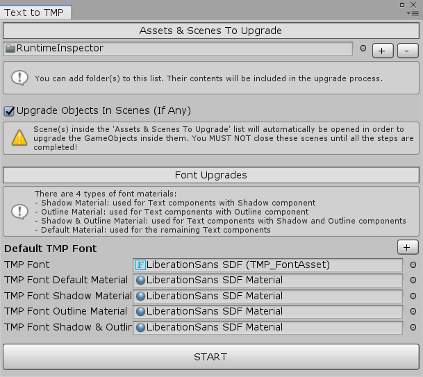

# Text To TextMesh Pro Upgrade Tool for Unity



**Available on Asset Store:** https://assetstore.unity.com/packages/tools/utilities/text-to-textmesh-pro-upgrade-tool-176732

**Forum Thread:** https://forum.unity.com/threads/text-to-textmesh-pro-upgrade-tool-open-source.947948/

**Discord:** https://discord.gg/UJJt549AaV

**[Support the Developer ☕](https://yasirkula.itch.io/unity3d)**

This asset helps you upgrade the **Text**, **InputField**, **Dropdown** and **TextMesh** objects in your projects to their **TextMesh Pro** variants. It also upgrades the scripts so that e.g. `Text` variables in those scripts become `TMP_Text` variables. Then, it reconnects the references to the upgraded components (e.g. if a public variable was referencing an upgraded *Text* component, it will now reference the corresponding *TextMeshProUGUI* component).

## INSTALLATION

There are 5 ways to install this plugin:

- import [TextToTMP.unitypackage](https://github.com/yasirkula/UnityTextToTextMeshProUpgradeTool/releases) via *Assets-Import Package*
- clone/[download](https://github.com/yasirkula/UnityTextToTextMeshProUpgradeTool/archive/master.zip) this repository and move the *Plugins* folder to your Unity project's *Assets* folder
- import it from [Asset Store](https://assetstore.unity.com/packages/tools/utilities/text-to-textmesh-pro-upgrade-tool-176732)
- *(via Package Manager)* add the following line to *Packages/manifest.json*:
  - `"com.yasirkula.texttotmp": "https://github.com/yasirkula/UnityTextToTextMeshProUpgradeTool.git",`
- *(via [OpenUPM](https://openupm.com))* after installing [openupm-cli](https://github.com/openupm/openupm-cli), run the following command:
  - `openupm add com.yasirkula.texttotmp`

## HOW TO

Before proceeding, **you are strongly recommended to backup your project**; just in case.

- Open the **Window-Upgrade Text to TMP** window
- Add the prefabs, Scenes, scripts and ScriptableObjects to upgrade to the **Assets & Scenes To Upgrade** list (if you add a folder there, its whole contents will be upgraded)(ScriptableObjects' *Font* variables will be upgraded). If an Object wasn't added to that list but it had references to the upgraded components, those references will be lost
- To determine which Unity *Fonts* will be upgraded to which TextMesh Pro *FontAssets*, use the **Font Upgrades** list
- Hit **START** and then follow the presented instructions. To summarize:
  - **Step 1/3: Upgrading Scripts:** Decide which scripts should be upgraded; e.g. `Text` variables in those scripts will become `TMP_Text` variables
  - **Step 2/3: Upgrading Components:** Decide which prefabs/Scenes should be upgraded; e.g. *Text* components in those prefabs/Scenes will be upgraded to *TextMeshProUGUI* components
  - **Step 3/3: Reconnecting References:** Decide whether or not the references to the upgraded components should be restored; e.g. if a public variable was referencing an upgraded *Text* component, it will now reference the corresponding *TextMeshProUGUI* component

## KNOWN LIMITATIONS

- If an InputField or Dropdown prefab instance's UnityEvent is modified (i.e. it's different from the prefab asset), that modification can't be restored after the upgrade process on Unity 2019.2 or earlier if a script was modified during the upgrade process

## EXAMPLES

### Upgrading [RuntimeInspector](https://github.com/yasirkula/UnityRuntimeInspector)

Add `Plugins/RuntimeInspector` folder to the **Assets & Scenes To Upgrade** list and then upgrade everything (scripts, components, references). No manual intervention necessary.

### Upgrading [IngameDebugConsole](https://github.com/yasirkula/UnityIngameDebugConsole)

Add `Plugins/IngameDebugConsole` folder to the **Assets & Scenes To Upgrade** list and then upgrade everything. No manual intervention necessary.

### Upgrading [DynamicPanels](https://github.com/yasirkula/UnityDynamicPanels)

Add `Plugins/DynamicPanels` folder to the **Assets & Scenes To Upgrade** list and then upgrade everything. While upgrading the scripts, *DynamicPanelsCanvasEditor.cs* will throw a compiler error. Fix it as follows before proceeding to upgrade the components:

```csharp
anchoredPanelGUIStyle = new GUIStyle( "box" )
{
	alignment = TextAnchor.MiddleCenter, // <-- Changed here to TextAnchor.MiddleCenter
	clipping = TextClipping.Clip
};
```

**What happened:** While UI system uses `TextAnchor`, TMP uses `TextAlignmentOptions`. The plugin assumed that it was upgrading a `Text`'s *alignment* property here but it was actually breaking a `GUIStyle`'s *alignment* property. While upgrading the scripts, the plugin doesn't use advanced stuff like lexers in order to avoid any 3rd party dependencies. However, this can result in rare false positives like this.

### Upgrading [SimpleFileBrowser](https://github.com/yasirkula/UnitySimpleFileBrowser)

Add `Plugins/SimpleFileBrowser` folder to the **Assets & Scenes To Upgrade** list and then upgrade everything. While upgrading the scripts, *FileBrowser.cs* will throw a compiler error. Fix it as follows before proceeding to upgrade the components:

```csharp
// Credit: https://forum.unity.com/threads/calculate-width-of-a-text-before-without-assigning-it-to-a-tmp-object.758867/#post-5057900
private int CalculateLengthOfDropdownText( string str )
{
	float totalLength = 0;

	TMPro.TMP_FontAsset myFont = filterItemTemplate.font;

	float pointSizeScale = filterItemTemplate.fontSize / ( myFont.faceInfo.pointSize * myFont.faceInfo.scale );
	float emScale = filterItemTemplate.fontSize * 0.01f;

	float styleSpacingAdjustment = ( filterItemTemplate.fontStyle & TMPro.FontStyles.Bold ) == TMPro.FontStyles.Bold ? myFont.boldSpacing : 0;
	float normalSpacingAdjustment = myFont.normalSpacingOffset;

	for( int i = 0; i < str.Length; i++ )
	{
		TMPro.TMP_Character character;
		if( filterItemTemplate.font.characterLookupTable.TryGetValue( str[i], out character ) )
			totalLength += character.glyph.metrics.horizontalAdvance * pointSizeScale + ( styleSpacingAdjustment + normalSpacingAdjustment ) * emScale;
		else
			totalLength += 5;
	}

	return (int) totalLength + 10;
}
```

**What happened:** Previously, we were using `Font.RequestCharactersInTexture` and `Font.GetCharacterInfo` but `TMP_FontAsset` doesn't have these functions, so we had to upgrade this function manually.

### Upgrading [ImageCropper](https://github.com/yasirkula/UnityImageCropper)

Add `Plugins/ImageCropper` folder to the **Assets & Scenes To Upgrade** list and then upgrade everything. While upgrading the scripts, *FontSizeSynchronizer.cs* will throw a compiler error. Fix it as follows before proceeding to upgrade the components:

```csharp
private void Awake()
{
	if( texts.Length == 0 )
		return;

	canvas = texts[0].canvas;

	initialBestFitSizes = new int[texts.Length];
	for( int i = 0; i < texts.Length; i++ )
		initialBestFitSizes[i] = (int) texts[i].fontSizeMax; // <-- Added (int) typecast here
}

// Credit: https://forum.unity.com/threads/textmeshpro-precull-dorebuilds-performance.762968/#post-5083490
public void Synchronize()
{
	if( canvas == null || !gameObject.activeInHierarchy )
		return;

	int minSize = int.MaxValue;
	for( int i = 0; i < texts.Length; i++ )
	{
		TMPro.TMP_Text text = texts[i];

		text.fontSizeMax = initialBestFitSizes[i];
		text.enableAutoSizing = true;
		text.ForceMeshUpdate();

		int fontSize = (int) text.fontSize;
		if( fontSize < minSize )
			minSize = fontSize;
	}

	for( int i = 0; i < texts.Length; i++ )
	{
		texts[i].fontSize = minSize;
		texts[i].enableAutoSizing = false;
	}
}
```

**What happened:** Previously, we were using `TextGenerator` to calculate the *Best Fit* font size but TextMesh Pro doesn't use TextGenerator, so we had to upgrade this function manually.
